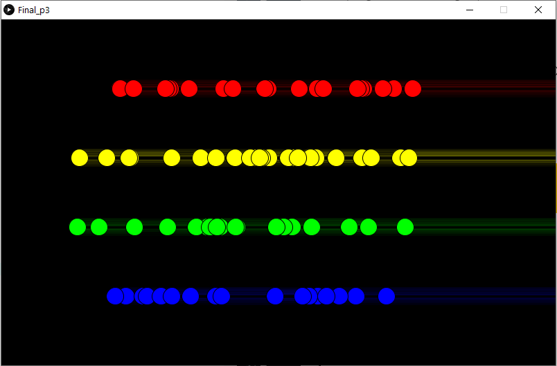
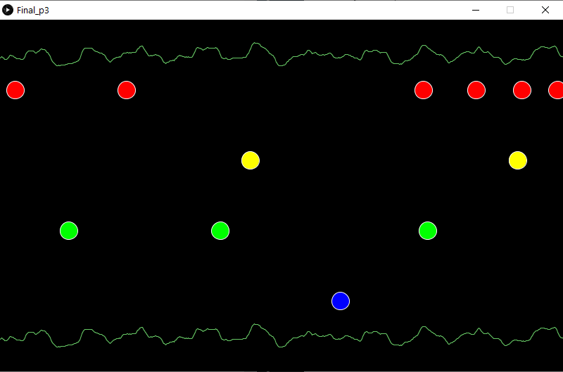
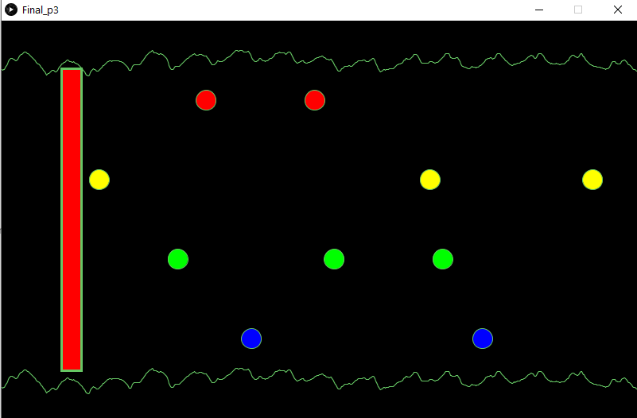
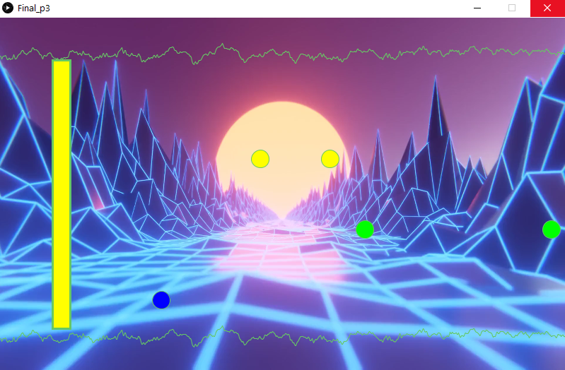
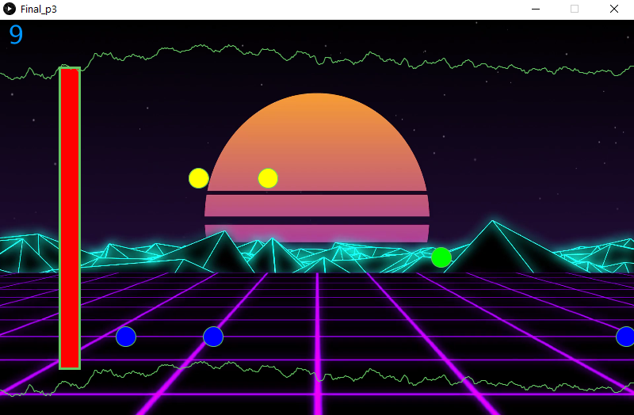
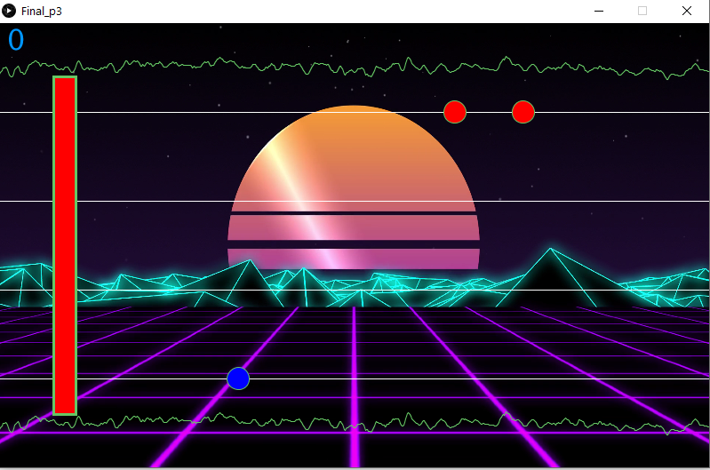
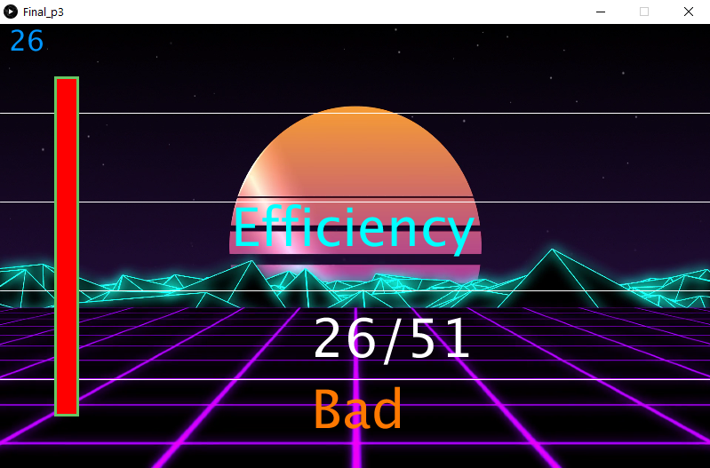
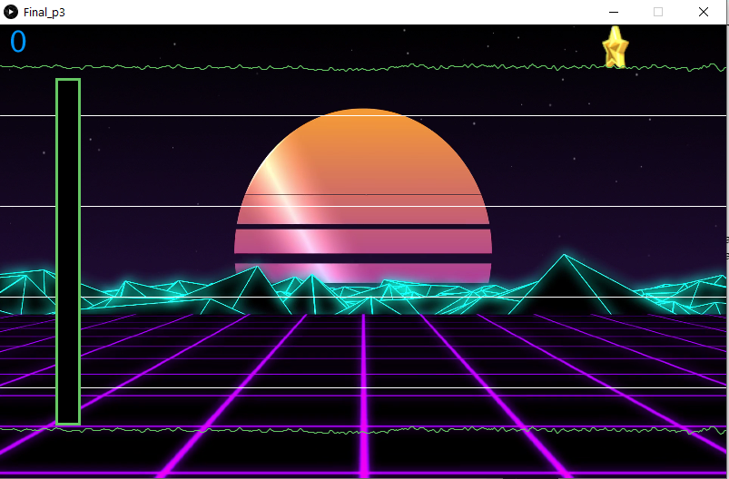

## Final Project: Rhythm Game

### Description 

It is a Rhythm based game where the player must correcly press buttons at the right time. the buttons corrospond to colored nodes that go across the screen until they reach a mark where the appropriate button is presses. on the breadboard you have 4 distinct colored buttons that corrospond to similar colored nodes that come on the screen.when the nodes reach the rectangle at the end of the screen the playermust push the appropriatly colored button in accordance to the timing of the node  reaching the rectangle.when the right button is pressed at the right time 1 is added to the score if the wrong button is pressed than the score is reduced by 1 if you gain enough score than a star will appear on the top right of the screen. upto 3 stars the game would end after the music has finished its first loop after the game has ended the total score and score gained is displayed and a rating is given depending on the score

### Circuit

The circuit is simple it has 4 buttons each connected to ground and each connected to its own digital pins

### Layer 1

make the notes class that spawned and sorted each of the notes to its own row accoring to its color

### Layer 2

made a loop sequence in the draw function that allowed the notes after a certain time rather than all toghether 
added the music waves see sources below for where to find the souce form where I got it from

### Layer 3

made the marker class what told the player when to press the button and the marker also changed color when a note passed through it

### Layer 4

made the button_press class that allowed the notes passing through the marker to give score if the right button is pressed

### Layer 5

fixed a ton of bugs with the button press class / spawning and changed the background for a darker one.
also added score to the top left

### Layer 6

fixed more bugs with the button press class letting it be more reliable and added lines to have better visual clarity with the notes

### Layer 7

added a endgame function that give score/total_score_possible and a rating on how well you did

### Layer 8

added animated stars that will appear when a certain score is reached 

### Video

There is a video as Mov1 and Mov2(the finished stage) avalible to see a demonstration

### Sources

for the music waves I refered to the builtin example for minin sound library. Example->Contributed libraries-> Minin-> AudioPlayer->loop

for the background video I refered to the example provided by minim.effects library at http://code.compartmental.net/tools/minim/quickstart/

for the video itself its a .mov video from https://pixabay.com/videos/search/looping/?pagi=1

### Difficulties

I had a lot of problems with the notes and button presses a lot of it was trail and error of all the possible solution I could think of
until one worked. most the problems was just accumalted small errors

I had problems with processing reading the values from arduino but the professor helped me understand how the code of slicing worked and where my problem was.
