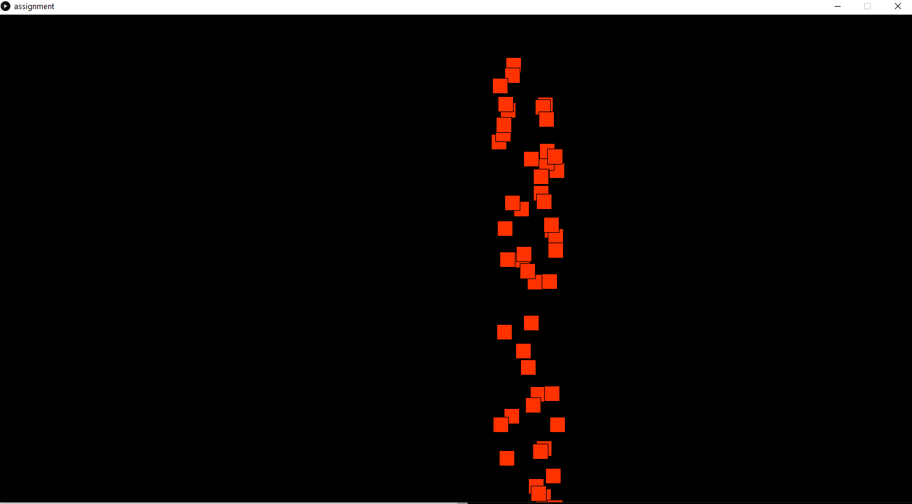
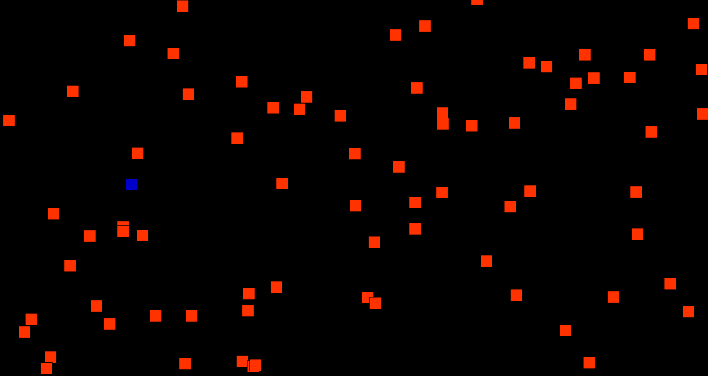

## Assignment Production

#### The game is about dodging enemy projectiles with a on screen player model that is controlled by the mouse

#### First Layer

made a black rectangle background and spawned rectangles with randomized coordinated

#### Second Layer 

added the mouse controlled player and adjested the values of the enemy projectiles so that they would be further apart

#### Problems

1. didnt know how many funtions I needed at the start. took a more "go with the flow approach" to see what I needed 

2. getting the projectiles to spawn seperatly was hard. has to make a another array that would display the projectiles and would start off empty while the array declared with random projectiles would add the values into the display array one by one after a certain amount of frames have passed

3. collision was hard. it is still unreliable and may need a better functions or needs the to scan a larger area for collision
