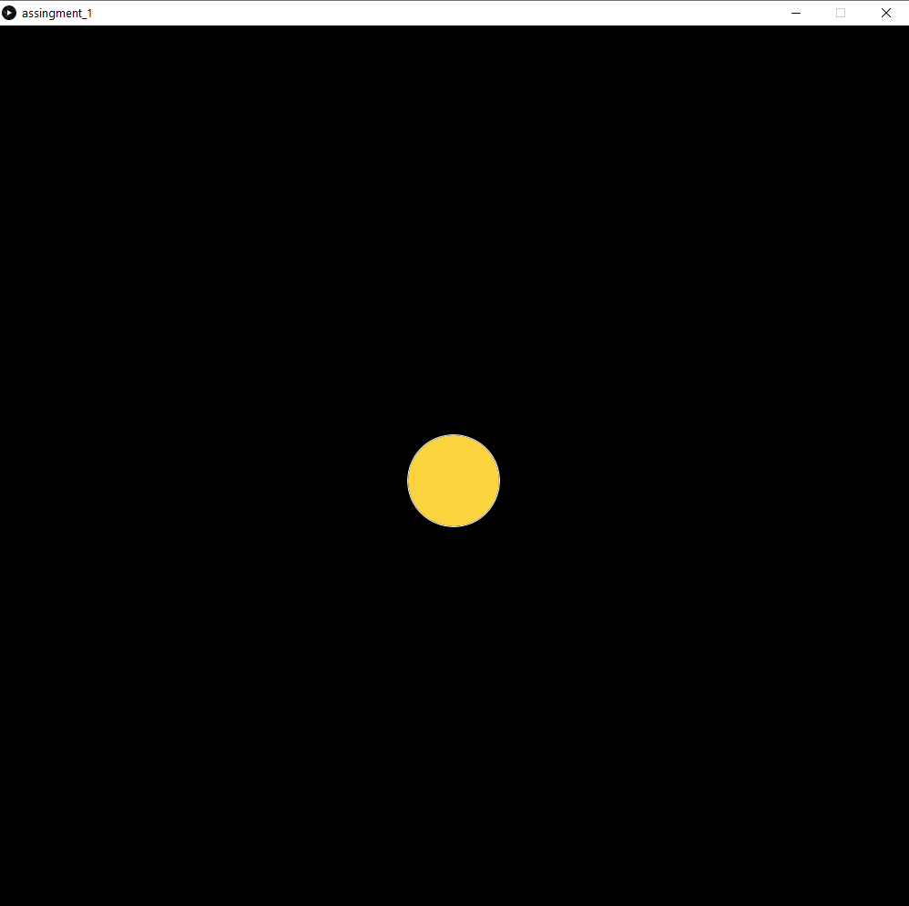
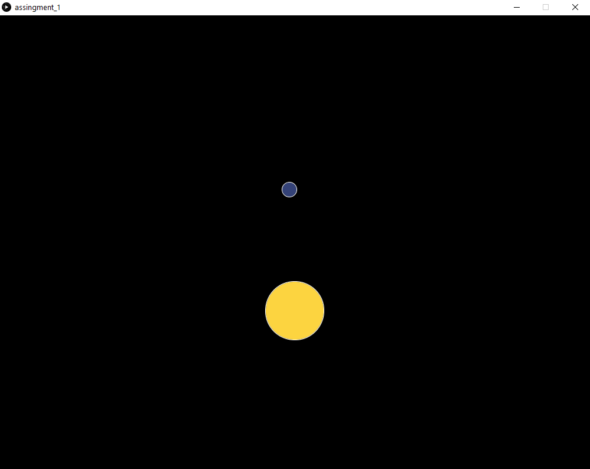
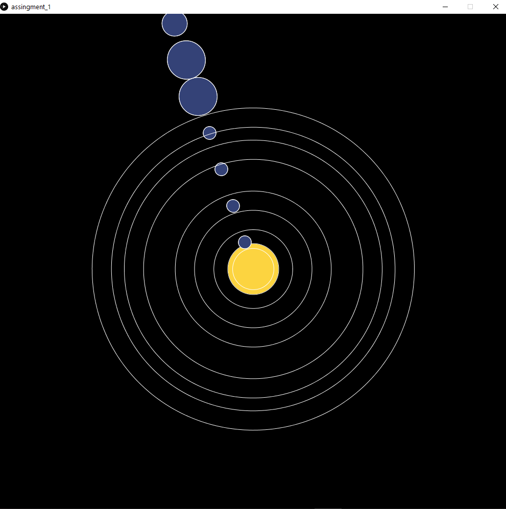
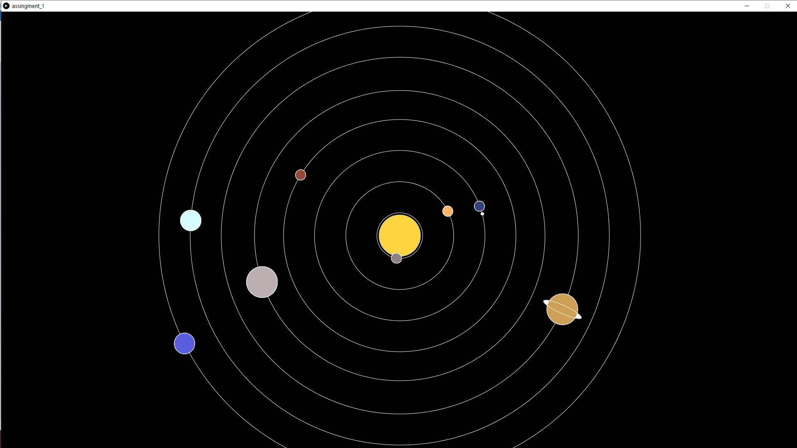

## Assignment 1 Solar System

The program displays a simplified version of the solar system with 
all the planets moving at different speeds around the sun

#### Layer 1

added the sun and the transformation at the center of the screen 

#### Layer 2

added a function that rotated the planets around the center of the screen and added a test planet

#### Layer 3

added all the planets with different sizes as welll as a ring that tells the path of each planet

#### Layer 4

added color to all the planets and fixed the problem with the rings as well as added a random start for each planet

#### Difficulty

getting the transformations was tricky but source added by the professor https://www.youtube.com/watch?v=o9sgjuh-CBM helped fix the problem.

somtimes the radius is the diameter and vice-versa half or increase values if arguments are different from what you expected.
