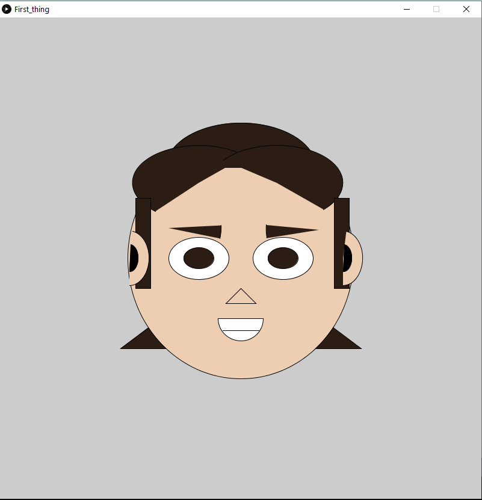

### Problems:

It was a lot of trail and error with the coordinates, I tried to create a mouse clicked function there clicking the picture at a point will give the coordinates of that point but some JAVA syntax errors occured while trying it. 

### Note:

if you try to draw more than around 120 lines the software stops drawing more thing. there is a low cap on the amount of distinct drawing you can make
