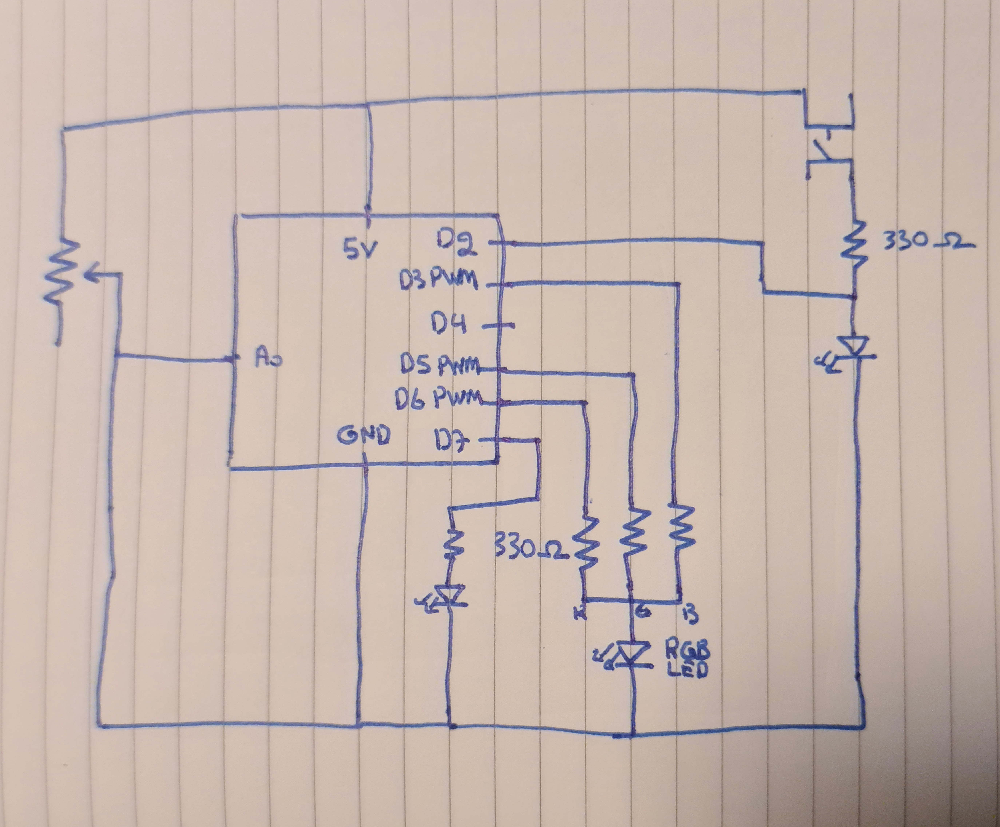

## Production Assignment

#### Discription

the program uses a analog potentiometer to change color of a RGB LED by increasing the value of the potentiometer the color of the LED will change the program also uses a digital sensor (button) to turn on and off a two LED's if the button is not pressed than one of the two LED's is one and if the button is pressed than the LED on will turn off and the LED off will turn on

Muhammad Bin Nauman mbn304

Due: 16 June 1AM

#### Circuit Schematic

#### Analog Circuit

First made a circuit for the potentiometer to see if it works. used the example given in class

added a RGB LED. connected the three color pins to 330 Ohm resistors and added the ground wire to the 4th pin of the LED. connected the three RGB pins to Digital PWN section of the board. used the values taken by the pin connected to the potentiometer to give different Values to the RGB pins of the LED. this gives the LED different colors depending on the how high or low the potentiometer is.

#### Digital Circuit

added a button that would power a LED (with resistor) when pressed and connected a wire that would detect if electricity would pass through the button. plugged the wire into a pin on the Digital side of the red board.

added another LED that would turn off if the button LED was on and vice versa. this was done by connecting a wire to a Digital pin on the redboard that would give it a high value whenever the value of the button connected LED was Low and vice versa.

#### Difficulty

The redboard connector has really bad contact points had to bend the wires inorder to connect them

Forgot to use a resistor with one of the LED's caused it to explode

#### Helpful Source

Sparkfun has a youtube channel that does tutorials
