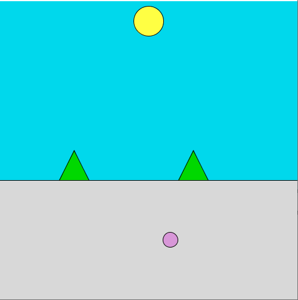
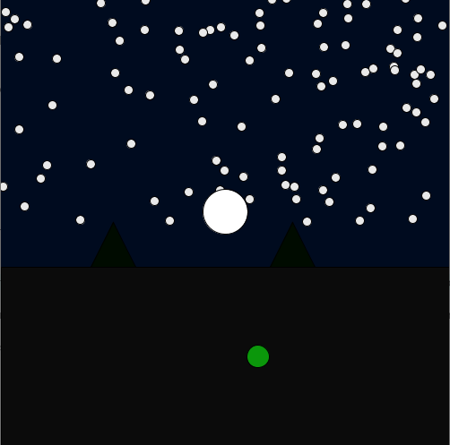

## Production Assignment: Day/Night Simulation

#### Discription

the program uses the light sensor to simulate day and night. the colors of all the objects will change depending on the amount of light recieved on the light sensor the potentiometer allow you to move the player from left to right on the screen and will also change the players color the light sensor will also change the color of the player

controls: change the value of the potentiometer to move the player and chage the lighting conditions around you to change the time of the day

 Muhammad Bin Nauman
 Due: 21 June 1PM

#### Circuit Schematic

the program uses a light sensor with ground and power wires, 10K Ohm resistor as well as three analog reading wires. ground and power the light sensor as usual and than plug each of the other three wires into analog pins A0 A1 A2. the program also uses a potentiometer. ground and power the potentiometer and add two wires for analog reading to A3 and A4.

#### layer 1

added two circles one controlled by the potentiometer to move left and right and the other controlled by the light sensor to control the color. the background color is also controlled by the light sensor

#### layer 2

added a ground and some trees that would also change the color according to the light avalible. made the sun move up and down as well as change color to become either the sun or moon. 

#### layer 3

added randomly generated stars that would appear when the light sensor vlaue drops below a certain value. corrected colors to make them better with the day and night cycle. 

#### Video

video of the two stages are avalible as mov1 and mov2 in the folder

#### Difficulty

Some problems getting processing to read values from the arduino IDE but looking at the recorded lecture again helped some my problems. the problems were with the slicing and cutting of the string values.
