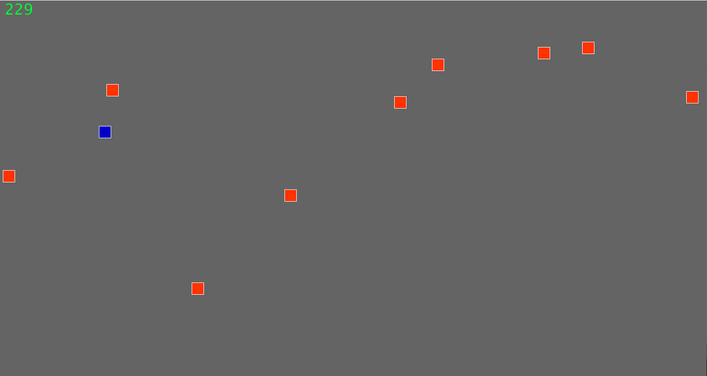
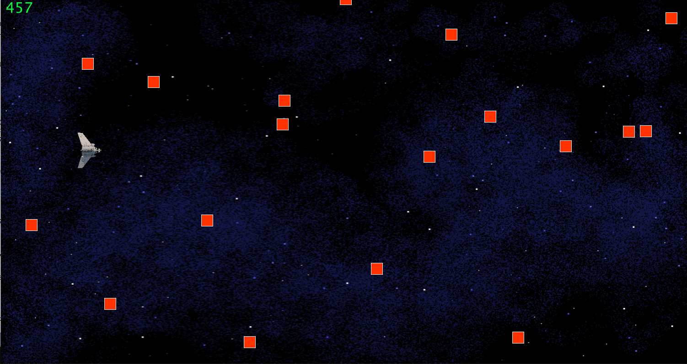
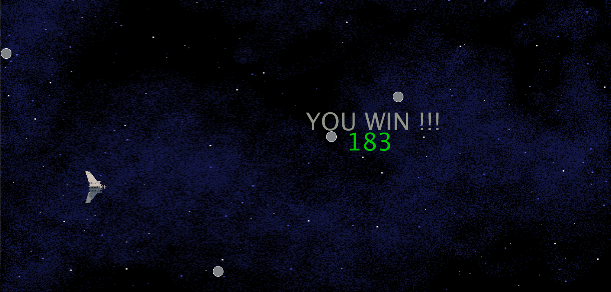
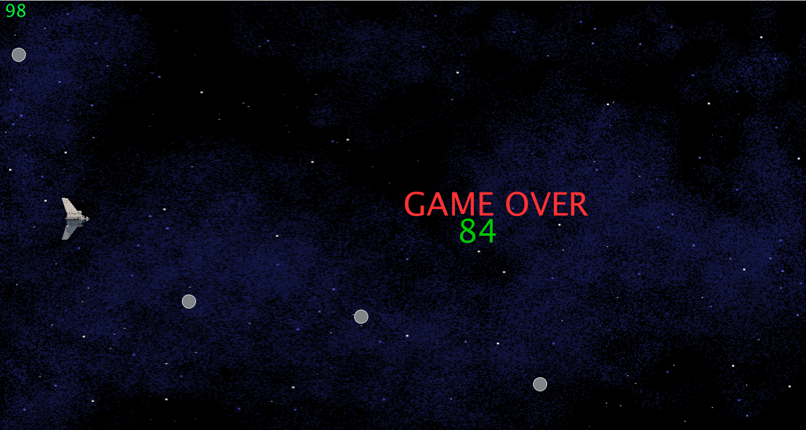
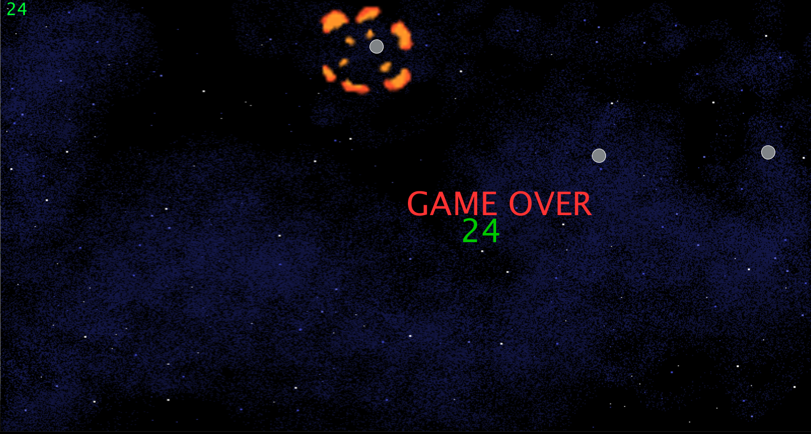
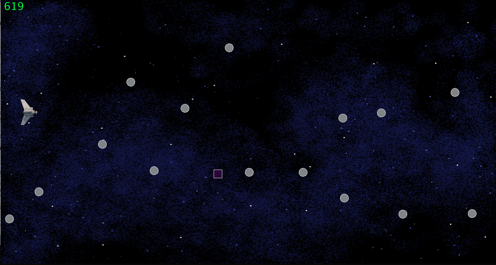

## Midterm Project: Asteroids

#### Discription

The Player will controll a ship that will go through a asteroid field that will increase in density as the time passes The player must avoid collision from the asteroids while also collecting optional bonus points until a caertain time has passed. after that the game will be won and the final score will be displayed

Inspirarion: any old space game 

Muhammad Bin Nauman mbn304

Due: 10 June 1AM

Instruction: control the ship with the mouse and dodge the asteroids.

#### Sketch

Made the entire concept of the game and what will it have along with some bonus features that sadly didnt make it because of annoying bug fixes.

#### Layer 1

Displayed a square that is controlled by a mouse 

#### Layer 2

Created a array that would spawn enemies in as red squares at random locations 

#### Layer 3

added background image and player image as well as made a function that controlled the amount of enemies to spawn into the screen and a difficulty scaler 

#### Layer 4

added a endgame condition. stoped the game from crashing at the end because of overloading objects. added text with the game is won 
 
 #### Layer 5

got collision working and added game over endgame.

#### Layer 6

added some collision animation and fixed small bugs. ex(enemy spawner/ endgame/ score/ collision again)

#### Layer 7

added a new class bonus points that will give extra points when collected

#### Difficulty

Collision:

Endgame:

Sound: 

