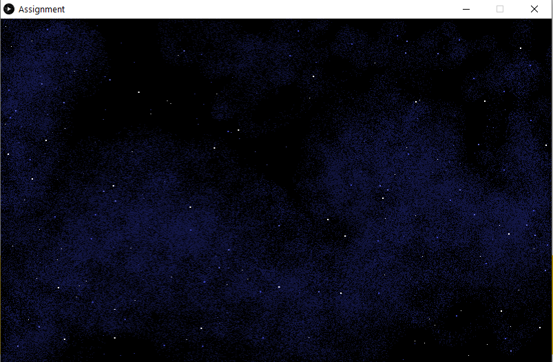
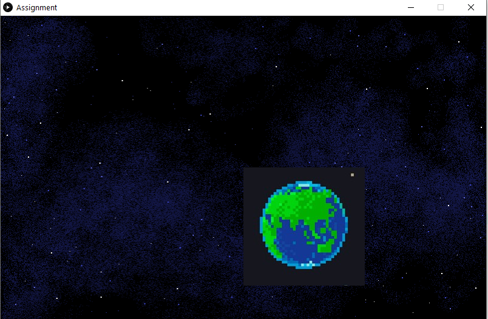
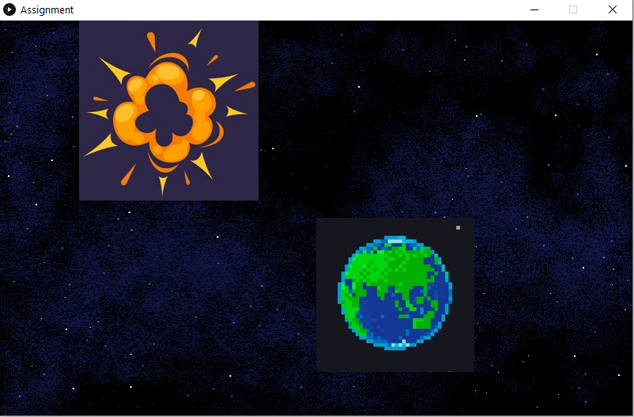
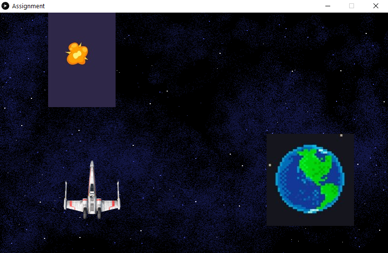

## Assignment animation

The program uses a set of images to make a animation 
The program also had a intended use of moving a image across the screen

#### Layer 1

added a background image 

#### Layer 2

added another image 

#### Layer 3

added another image and make two images a array of images that cycled through all the images to make a animation

#### Layer 4

 added image that moved across the screen 

#### Difficulty

Creating a instance of a class gives a error but brownxllama at discord helped me with the problem

the instance you’re creating loads an image and the way processing works only allows for images to be loaded in setup or AFTER setup finishes executing so by instantiating in setup you basically load the image in the setup function.

